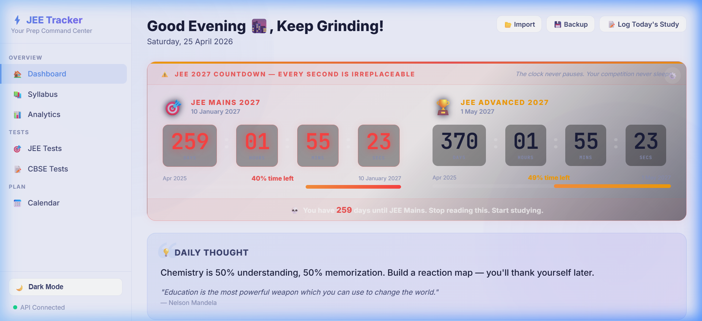
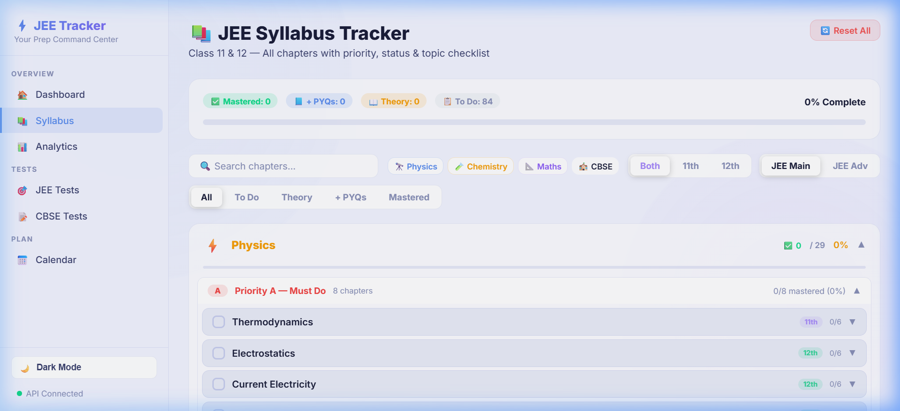
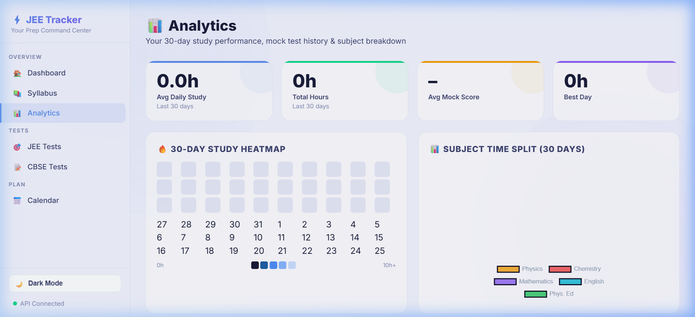
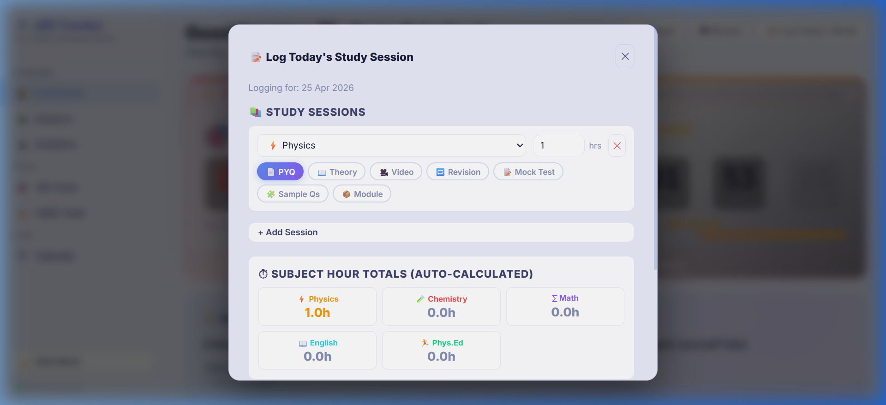
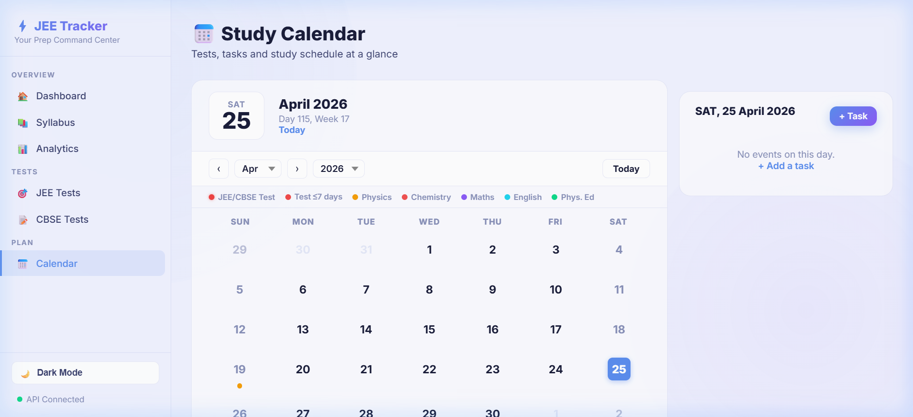
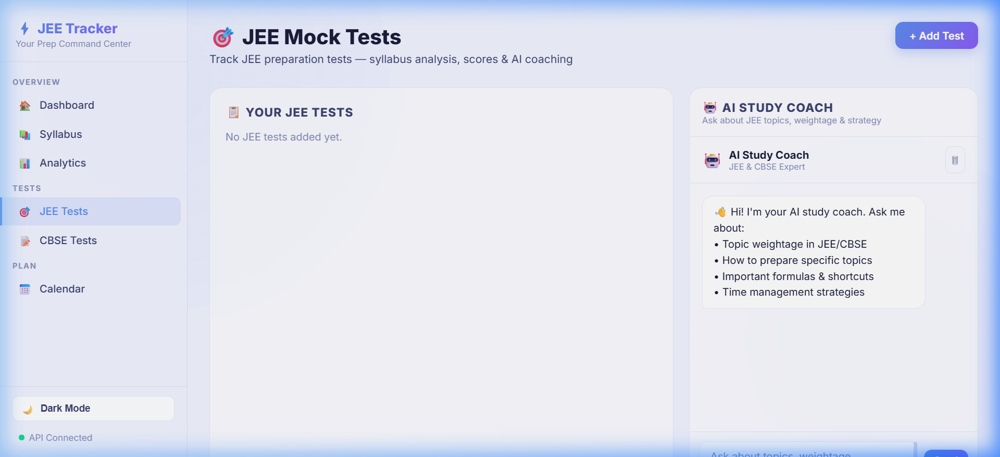

<div align="center">

# ⚡ JEE Tracker

### The AI-Powered Preparation Command Center for JEE & CBSE

**Stop guessing. Start knowing exactly where you stand.**

Most JEE aspirants study 8+ hours daily but have *zero clue* whether they're actually improving.  
JEE Tracker replaces guesswork with **deterministic, AI-analyzed daily performance ratings** — so every single study session gets a forensic breakdown.

[](https://nodejs.org/)
[](#license)
[](#multi-provider-ai)

</div>

---

## 📸 Screenshots

<details open>
<summary><strong>🏠 Dashboard — Your Daily Command Center</strong></summary>
<br>
<p align="center">
  
</p>

> Live countdown timers to JEE Mains & Advanced. Today's study stats, task list, 30-day momentum heatmap, subject progress bars — all in one glance.

</details>

<details>
<summary><strong>📚 Syllabus Tracker — Chapter-Level Granularity</strong></summary>
<br>
<p align="center">
  
</p>

> 100+ chapters across Physics, Chemistry & Mathematics. Each chapter tracked through 4 stages: `Todo → Theory Done → PYQs Done → Mastered`. Filter by class (11th/12th), priority, and target exam (Mains vs Advanced).

</details>

<details>
<summary><strong>📊 Analytics — 30-Day Performance Forensics</strong></summary>
<br>
<p align="center">
  
</p>

> Study heatmaps, subject time-split charts, mock test score trends, and a dedicated Error Book for tracking recurring mistakes.

</details>

<details>
<summary><strong>📝 AI Study Log — Not a Diary, a Rating System</strong></summary>
<br>
<p align="center">
  
</p>

> Log your sessions by type (PYQ, Theory, Video, Mock, Module) → AI analyzes quality, balance, and depth → gives you a deterministic 0-100 rating with strengths, gaps, and tomorrow's action plan.

</details>

<details>
<summary><strong>📅 Calendar & 🎯 Test Scheduler</strong></summary>
<br>
<p align="center">
  
  
</p>

> Visual calendar with color-coded events. Separate JEE & CBSE test scheduling with automatic conflict detection and urgency warnings.

</details>

---

## 🔥 Why This Exists (The Problem)

Every JEE aspirant faces the same invisible trap:

| The Symptom | What Actually Happens |
|---|---|
| *"I studied 10 hours today"* | 6h was YouTube + passive reading. Effective study was ~3h. |
| *"I'm covering the syllabus"* | You've touched 40 chapters but mastered 4. |
| *"My mocks are fine"* | You're scoring 55% and calling it "decent." |
| *"I'll revise later"* | You forgot 70% of what you studied 3 weeks ago. |

**The core problem:** Students track *time spent* but never track *quality of work done*. Notion templates and habit trackers count checkboxes. They don't tell you that your 8-hour day was actually a D-grade session because you only watched lectures and skipped problem-solving.

JEE Tracker solves this with a **deterministic rating algorithm** that cannot be fooled.

---

## 💎 What Makes This Different (Killer Features)

### 1. 🧮 Deterministic Study Rating Algorithm
> **This is not another to-do list wearing a JEE hoodie.**

Every study session is scored through a formula that weights:

| Factor | Weight | Logic |
|---|---|---|
| **Session Quality** | 0–75 pts | PYQ practice = 75pts. Theory + Video = 20pts. Video-only = 14pts. The algorithm *punishes passive studying*. |
| **Subject Balance** | 0–25 pts | All 3 core subjects (PCM) = 25pts. Only 1 subject = 3pts. |
| **Time Multiplier** | 0.0–1.0x | Non-linear curve: 2h = 0.42x, 6h = 0.73x, 10h = 1.0x. Diminishing returns after 8h. |

**Final Rating** = `(Quality + Balance) × Time Multiplier`

The AI can then adjust ±15 points based on your *written description* of what you actually did — but it **cannot override the math**. A day of watching 8 hours of video gets capped at ~14-25/100 no matter what the AI thinks.

> **Translation:** You can't game it. A focused 4h PYQ grind scores higher than an 8h lecture binge.

### 2. 🤖 Multi-Provider AI Coach (Not Locked to One API)
Works with **any** of these — swap with one line in `.env`:

| Provider | Recommended Model | Cost |
|---|---|---|
| NVIDIA NIM | Llama 3.3 70B | Free tier available |
| OpenAI | GPT-4o-mini | ~$0.15/1M tokens |
| Google | Gemini 2.5 Flash | Free tier available |
| Anthropic | Claude 3 Haiku | ~$0.25/1M tokens |

### 3. 📷 AI Syllabus Ingestion (Vision)
Upload a **photo or PDF** of your coaching institute's printed syllabus → the AI Vision model reads it, categorizes every topic into Physics/Chemistry/Mathematics, and populates your tracker automatically. No manual typing.

### 4. 📉 4-Stage Chapter Progression (Not Binary Checkboxes)
Each chapter moves through:
```
📋 Todo  →  📖 Theory Done  →  📘 PYQs Done  →  ✅ Mastered
```
Your "Syllabus % Complete" is weighted — a chapter at "Theory Done" counts as 25% ready. "PYQs Done" = 62.5%. Only "Mastered" = 100%. This means your dashboard number is **honest**, not inflated.

### 5. 🔥 AI Momentum Heatmap
The 30-day heatmap isn't just "hours studied" — each cell is **color-coded by your AI rating**:
- 🔴 **Red** = rating < 30 (Critical day)
- 🟠 **Orange** = 30–60 (Needs work)
- 🟡 **Yellow** = 60–80 (Average)
- 🟢 **Green** = 80+ (Solid day)

One glance tells you if your week was productive or theatrical.

### 6. 📒 Error Book (Mistake Forensics)
Log every wrong answer with the *exact concept you got wrong* and the *correct logic*. Sorted by subject and searchable. Before any exam, review your Error Book — it's your personalized revision guide, curated from your own failures.

---

## 🏗️ Architecture

```
jee-tracker/
├── server.js              # Express server + AI API adapter (OpenAI/Gemini/Anthropic/NIM)
├── .env                   # Your API keys (never committed)
├── .env.example           # Template for all 4 providers
├── public/
│   ├── index.html         # Dashboard — countdowns, stats, tasks, heatmap
│   ├── syllabus.html      # 100+ chapter tracker with filters & progress
│   ├── analytics.html     # Charts, heatmaps, mock history, error book
│   ├── calendar.html      # Monthly calendar with task/test events
│   ├── jee-tests.html     # JEE test scheduler with countdown timers
│   ├── cbse-tests.html    # CBSE test scheduler
│   └── assets/
│       ├── css/style.css  # Full design system (dark/light mode, glassmorphism)
│       └── js/
│           ├── storage.js      # localStorage abstraction + auto-backup
│           ├── dashboard.js    # Dashboard logic + AI log analysis
│           ├── syllabus.js     # Chapter rendering + status management
│           ├── syllabus-data.js # Complete JEE+CBSE curriculum database
│           ├── analytics.js    # Chart.js visualizations
│           ├── calendar.js     # Calendar rendering + event system
│           ├── ai.js           # AI API client
│           ├── jee-tests.js    # JEE test CRUD + scoring
│           └── cbse-tests.js   # CBSE test CRUD + scoring
└── data/                  # Auto-backup JSON (gitignored)
```

### How the AI Layer Works

```
Browser (Client)                    Express Server                    AI Provider
┌──────────────┐     POST /api/*    ┌──────────────┐    HTTPS        ┌──────────────┐
│  Frontend JS  │ ───────────────► │   server.js   │ ─────────────► │ OpenAI /     │
│  (ai.js)      │                  │               │                │ Gemini /     │
│               │ ◄─────────────── │  nimFetch()   │ ◄───────────── │ Anthropic /  │
│  API keys     │     JSON resp    │  + Anthropic  │    JSON resp   │ NVIDIA NIM   │
│  stored in    │                  │    adapter    │                │              │
│  localStorage │                  │               │                └──────────────┘
└──────────────┘                   └──────────────┘
```

- **API keys** can live in `.env` (server-side) OR in `localStorage` (browser-side, sent via headers)
- The server has a **unified adapter** that translates between OpenAI format and Anthropic's Messages API automatically
- All study data lives in **localStorage** with automatic JSON backup to `data/backup.json` on every write
- **No cloud database.** Your data stays on your machine.

---

## 🚀 Quick Start (< 2 minutes)

### Prerequisites
- [Node.js 18+](https://nodejs.org/) installed
- An API key from **any one** of: [NVIDIA NIM](https://build.nvidia.com) (free) · [OpenAI](https://platform.openai.com/api-keys) · [Google AI Studio](https://aistudio.google.com/apikey) · [Anthropic](https://console.anthropic.com/)

### Setup

```bash
# 1. Clone
git clone https://github.com/YOUR_USERNAME/jee-tracker.git
cd jee-tracker

# 2. Install dependencies
npm install

# 3. Configure your AI provider
cp .env.example .env
# Open .env, uncomment ONE provider block, paste your API key

# 4. Launch
npm start
# → Opens at http://localhost:5714
```

**Windows users:** Just double-click `start.bat` — it handles everything automatically.

### `.env` Example (Google Gemini — Free Tier)

```env
API_BASE_URL=generativelanguage.googleapis.com
API_PATH=/v1beta/openai/chat/completions
TEXT_MODEL=gemini-2.5-flash
VISION_MODEL=gemini-2.5-flash
NVIDIA_REASON_KEY=YOUR_GEMINI_API_KEY_HERE
NVIDIA_VISION_KEY=YOUR_GEMINI_API_KEY_HERE
```

> 💡 **Tip:** For the fastest experience, use lightweight models like `gpt-4o-mini`, `gemini-2.5-flash`, or `claude-3-haiku`.

---

## 📋 Complete Feature List

| Category | Feature | Status |
|---|---|---|
| **Dashboard** | Live JEE Mains & Advanced countdown (customizable dates) | ✅ |
| | Daily motivational thoughts & quotes (rotates daily) | ✅ |
| | Today's study hours, weekly total, streak counter | ✅ |
| | PCM syllabus analytics with donut charts | ✅ |
| | Task manager with subject color-coding | ✅ |
| | 30-day AI-rated momentum heatmap | ✅ |
| **Syllabus** | 100+ chapters across Physics, Chemistry, Mathematics | ✅ |
| | CBSE-exclusive subjects: English, Physical Education | ✅ |
| | 4-stage progression (Todo → Theory → PYQs → Mastered) | ✅ |
| | Revision counter per chapter | ✅ |
| | Priority groups (A/B/C/D) per subject | ✅ |
| | Filter by Class 11/12, JEE Main/Advanced, status | ✅ |
| | Topic-level checklist within each chapter | ✅ |
| **AI Features** | Deterministic study session rating (0-100) | ✅ |
| | Multi-type session logging (PYQ, Theory, Video, Mock, etc.) | ✅ |
| | AI-generated strengths, gaps, and tomorrow's plan | ✅ |
| | 30-day momentum analysis with JEE prediction | ✅ |
| | Syllabus auto-ingestion from PDF/image (Vision AI) | ✅ |
| | AI Study Coach chat interface | ✅ |
| **Analytics** | 30-day study heatmap (large format) | ✅ |
| | Subject time-split doughnut chart | ✅ |
| | Daily stacked bar chart (hours by subject) | ✅ |
| | Mock test score trend line | ✅ |
| | Test history table with grades | ✅ |
| | Error Book (mistake forensics) | ✅ |
| **Tests** | JEE test scheduler with live countdown | ✅ |
| | CBSE test scheduler | ✅ |
| | Subject-wise scoring and grade calculation | ✅ |
| | Coinciding test conflict detection | ✅ |
| **Calendar** | Monthly view with color-coded events | ✅ |
| | Task and test integration | ✅ |
| **Data** | All data in localStorage (100% offline) | ✅ |
| | Auto-backup to server JSON on every write | ✅ |
| | Manual export/import (JSON backup files) | ✅ |
| | Dark mode / Light mode with persistence | ✅ |
| | Multi-provider AI (OpenAI, Gemini, Anthropic, NVIDIA) | ✅ |

---

## 🔮 Roadmap

- [ ] **Spaced Repetition Engine** — Auto-schedule chapter revisions based on forgetting curve
- [ ] **Weak Topic Detection** — Flag chapters where you consistently lose marks in mocks
- [ ] **Predictive Backlog Risk** — AI warns you when your pace won't finish the syllabus in time
- [ ] **Mobile PWA** — Installable on phone for quick daily logging
- [ ] **Peer Benchmarking** — Anonymous comparison with other users' preparation stats

---

## 🤝 Contributing

PRs welcome. If you're a JEE aspirant who codes, you know exactly what features are missing.

1. Fork this repo
2. Create your feature branch (`git checkout -b feature/weak-topic-detection`)
3. Commit your changes
4. Push and open a Pull Request

---

## 📄 License

MIT — Use it, modify it, ship it.

---

<div align="center">

**Built for aspirants who are serious about the process, not just the result.**

*If this helped your preparation, star the repo ⭐*

</div>

